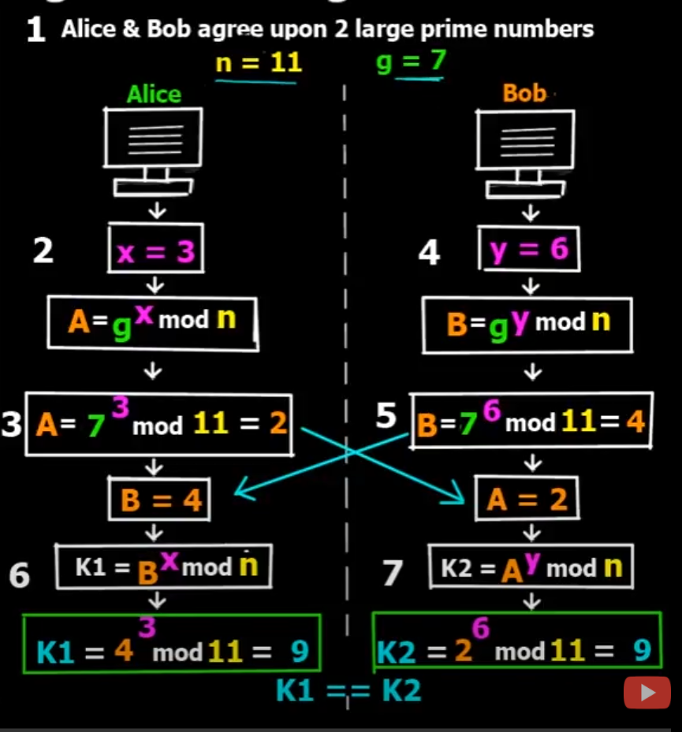

# Diffie–Hellman key exchange 迪菲-赫尔曼密钥交换

在前面我们聊了`One-Time Pad`, `Stream Cipher`, `Block Cipher`, 但是有一个重要的问题并没有解决，那就是秘钥的分发。不可能说通信双方在通信之前，先见个面协商一下秘钥key，这样非常不方便，但是又不能直接把key秘钥通过一个不安全的信道发出去，这样就会被攻击者截获。

所以我们需要有一种方法，可以让双方在完全没有对方任何预先信息的条件下通过不安全信道创建起一个密钥。这个密钥可以在后续的通讯中作为对称密钥来加密通讯内容，这就是秘钥交换的概念（key exchange）。

## Diffie–Hellman key exchange

以下内容来自维基百科：

`迪菲－赫尔曼密钥交换`是在美国密码学家`惠特菲尔德·迪菲`和`马丁·赫尔曼`的合作下发明的，发表于1976年。它是第一个实用的在非保护信道中创建共享密钥方法。它受到了瑞夫·墨克的关于公钥分配工作的影响。约翰·吉尔（John Gill）提出了`离散对数问题`的应用。该方案首先被英国GCHQ的马尔科姆·J·威廉森（Malcolm J. Williamson）在稍早的几年前发明，但是GCHQ直到1997年才决定将其公开，这时在学术界已经没有了研究这个算法的热潮了。

## 数学描述

详细的数学描述请大家参考维基百科https://zh.wikipedia.org/wiki/%E8%BF%AA%E8%8F%B2-%E8%B5%AB%E7%88%BE%E6%9B%BC%E5%AF%86%E9%91%B0%E4%BA%A4%E6%8F%9B

这里我们简单表示一下：

第一步，通信双方Alice和Bob个准备一个大的质数，Alice准备的质数是n=11, Bob准备的质数是g=7，n和g是公开的，任何第三方都可以获取到这个信息。

第二步，Alice准备一个随机自然数x=3, 除了Alice没有人知道x是多少，Alice通过计算g的x次方并且对n取模，得到结果大A

第三步，Alice把计算得到的结果A=2 发送给Bob，这个信息是公开的，任何人可以获取到A

第四步，Bob同样准备一个随机自然数y=6，除了Bob没有人知道y是多少，Bob通过计算g的y次方并且对n取模，得到结果大B

第五步，Bob把计算结果B=4，发送给Alice，，这个信息是公开的，任何人可以获取到B

第六步，Alice拿到B以后，对B求x次方并对n取模，得到K1=9

第七步，Bob拿到A以后，对A对y次方并对n取模，得到K2=9

K1 == K2， Alice和Bob可以使用K1，K2作为Key进行通信加密。

在整个通信过程中，攻击者是无法知道x，y以及k1，k2的，或者说计算的困难很大，感兴趣的同学可以在网上找到具体的数学问题，`离散对数问题`的求解。

## RSA

Diffie–Hellman key exchange 发明后不久出现了`RSA`，另一个进行公钥交换的算法。它使用了`非对称加密算法`。

下一期我们聊`RSA`。