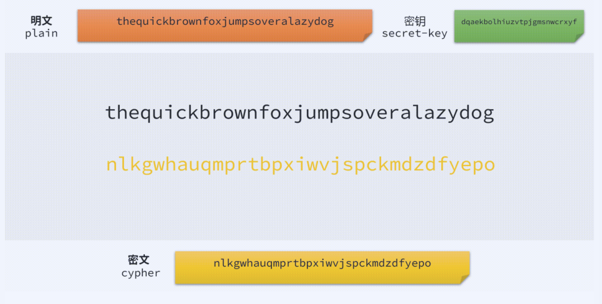

# 置换加密  Substitution Cipher


上一期我们聊了`凯撒密码`，在继续聊新内容之前，先想一下，为什么凯撒加密非常容易被破解？

原因就是因为字母表顺序平移这种算法的复杂度太低了，只有26种可能性的密钥，即使在没有计算机的古代也是非常容易破解的。

要提高破解的难度，就需要提高算法的复杂度。于是乎最容易想到的就是，既然有26个字母，那为啥不随机打乱顺序然后作为密钥呢？

OK，这就是这一期要聊的一种加密方法，叫Substitution Cipher，中文翻译成置换加密。

- 基于置换
- 密钥为26个字母的全排列之一
- 加密过程：对于每个单字母查表，改为对应字母
- 解密过程：反向查表
- 恺撒密码可以看作单表置换的一类特殊情况





## 置换加密的安全性

26个英文字母的排列组合，也就是26的阶乘种可能性，结果是：

```
# python
>>> import math
>>> math.factorial(26)
403291461126605635584000000
>>>
```

`403291461126605635584000000`，这个基本是天文数字了，暴力破解的话，需要循环遍历所有可能，光是循环这么多次，对于我们个人的电脑，这是一个不可能完成的任务。

粗略的估计了一下，我的电脑做这个循环，大概需要10年的时间。不信大家可以试试。

好的，也就是说，我们从这么多的可能排列组合里，随机选一个作为我们的密钥，使用它进行加密，理论上应该是非常安全的，因为暴力破解的时间成本太高了。

刚才这个26阶乘种可能性的密钥，这个天文数字换算成2的乘方的话，大概是2的88次方，在加密领域，我们一般把这种密钥的安全性称之为 88 bit security，这个等后面我们还会再提到的。

说了这么多，这种密钥安全么？实际上远没有我们想的那么安全，两点：

- 88 bit这个级别的安全性是非常低的，个人电脑做不到暴力破解，不代表强力的计算机集群做不到，以空间换时间
- 这种加密有一个致命弱点，导致它可以轻松破解（我们下次聊）


## 置换加密的Python实现


```python
import string
import random


def generate_key():
    letters = [l for l in string.ascii_letters[26:]]
    random.shuffle(letters)
    
    return dict(zip(string.ascii_letters[26:], letters))


def encrypt(key, message):
    cipher = ""
    for l in message:
        if l in key:
            cipher += key[l]
        else:
            cipher += l
    return cipher

key = generate_key()
print(key)

print(encrypt(key, "ATTACK"))
```

以一次运行结果为例

```python
python .\substitution.py
{'A': 'P', 'B': 'J', 'C': 'X', 'D': 'B', 'E': 'I', 'F': 'L', 'G': 'D', 'H': 'N', 'I': 'H', 'J': 'G', 'K': 'W', 'L': 'E', 'M': 'Z', 'N': 'U', 'O': 'T', 'P': 'V', 'Q': 'Q', 'R': 'M', 'S': 'Y', 'T': 'C', 'U': 'A', 'V': 'R', 'W': 'S', 'X': 'F', 'Y': 'O', 'Z': 'K'}
PCCPXW
```

解密我们就不演示了。就是一个反向查表。


------


今天就到这里，下次我们聊聊如何快速破解置换加密。