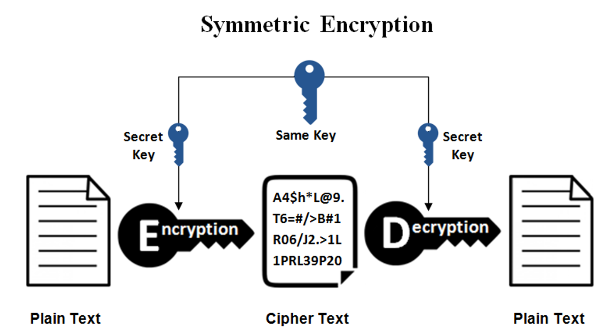
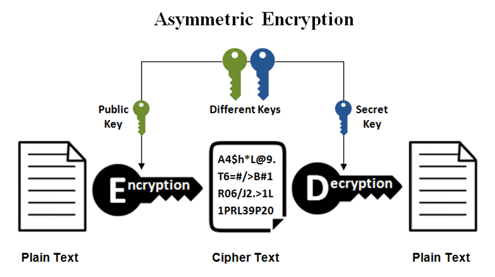

# 基本术语

再说基本术语之前，有两个英文单词先要搞清楚，因为很多时候和加密相关的资料都是英文的，这两个单词是肯定会遇到的：

- Cryptography
- Cryptology

这两个单词一般都翻译成`密码学`，但前者更加倾向于加密技术的应用，而后者更加倾向于加密技术的研究，或者一门学科。作为程序员或者运维人员，平时实际上使用比较多的是`Cryptography`，因为
不管是SSL还是HTTPS，都是加密技术的应用。

## 明文和密文，加密和解密

- `Plaintext` 未经加密的消息，任何人都可以读
- `Ciphertext` 加密后的消息，不可读
- `Key` 密钥，用于加密和解密（核心是算法）

## 加密的方法

- 对称加密 `Symmetric Cryptography` ，消息的发送者和接收者使用相同的key进行加密和解密
- 非对称加密 `Asymmetric Cryptography` (也叫 `Public-key Cryptography` )，消息的加密和解密使用不同的key

非对称加密不了解没有关系，后面我们会非常详细的介绍。

