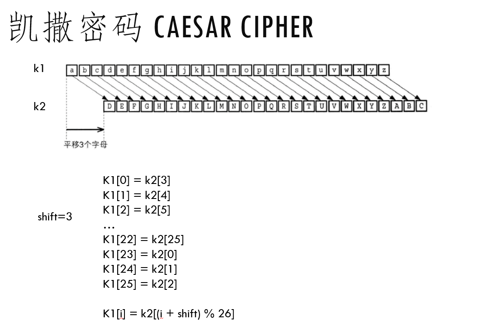

# 凯撒密码

## 维基百科解释

https://zh.wikipedia.org/wiki/%E5%87%B1%E6%92%92%E5%AF%86%E7%A2%BC

“是一种最简单且最广为人知的加密技术。凯撒密码是一种替换加密技术，明文中的所有字母都在字母表上向后（或向前）按照一个固定数目进行偏移后被替换成密文。例如，当偏移量是3的时候，所有的字母A将被替换成D，B变成E，以此类推。这个加密方法是以罗马共和时期凯撒的名字命名的，据称当年凯撒曾用此方法与其将军们进行联系。“

简单说就是字母表的平移，比如下图



把字母表平移三位的话(假如不区分大小写)，

A -> D
A -> E
...


比如凯撒要对其将军下达攻击`ATTACK`的命令，那么根据凯撒密码加密，加密后的密文为`DWWDFN`

ATTACK -> DWWDFN


## 用Python实现凯撒加密


```python
import string


def generate_key(shift):
    letters = string.ascii_letters[26:]
    key = {}
    num = 0
    for c in letters:
        key[c] = letters[(num + shift) % len(letters)]
        num += 1
    return key

def encrypt(key, message):
    cipher = ""
    for c in message:
        if c in key:
            cipher += key[c]
        else:
            cipher += c
    return cipher

key = generate_key(3)
message = "ATTACK"
cipher = encrypt(key, message)
print(cipher)
```

`generate_key` 可以根据我们平移多少位，生成我们的密钥，就是一个字母对

shift=3 的话，密钥为

```python
{'A': 'D', 'B': 'E', 'C': 'F', 'D': 'G', 'E': 'H', 'F': 'I', 'G': 'J', 'H': 'K', 'I': 'L', 'J': 'M', 'K': 'N', 'L': 'O', 'M': 'P', 'N': 'Q', 'O': 'R', 'P': 'S', 'Q': 'T', 'R': 'U', 'S': 'V', 'T': 'W', 'U': 'X', 'V': 'Y', 'W': 'Z', 'X': 'A', 'Y': 'B', 'Z': 'C'}
```

查询密钥，就可以知道ATTACK的密文是DWWDFN

```
A -> D
T -> W
T -> W
A -> D
C -> F
K -> N
```

## 用Python实现凯撒解密

解密非常简单，只要知道了shift是多少位，就可以生成一个用于解密的密钥，比如

```
def get_decryption_key(shift):
    dkey = {}
    letters = string.ascii_letters[26:]
    num = 0
    for c in letters:
        dkey[letters[(num + shift) % len(letters)]] = c
        num += 1
    return dkey
```

有了解密的密钥，只要查询对应就能解开密码

```
{'D': 'A', 'E': 'B', 'F': 'C', 'G': 'D', 'H': 'E', 'I': 'F', 'J': 'G', 'K': 'H', 'L': 'I', 'M': 'J', 'N': 'K', 'O': 'L', 'P': 'M', 'Q': 'N', 'R': 'O', 'S': 'P', 'T': 'Q', 'U': 'R', 'V': 'S', 'W': 'T', 'X': 'U', 'Y': 'V', 'Z': 'W', 'A': 'X', 'B': 'Y', 'C': 'Z'}
```

```
D -> A
W -> T
W -> T
D -> A
F -> C
N -> K
```

## 凯撒密码的破解


很简单，暴力破解即可。

收到多次密文，然后从平移1-26，26种可能尝试，找出有意义的解密明文即可。

