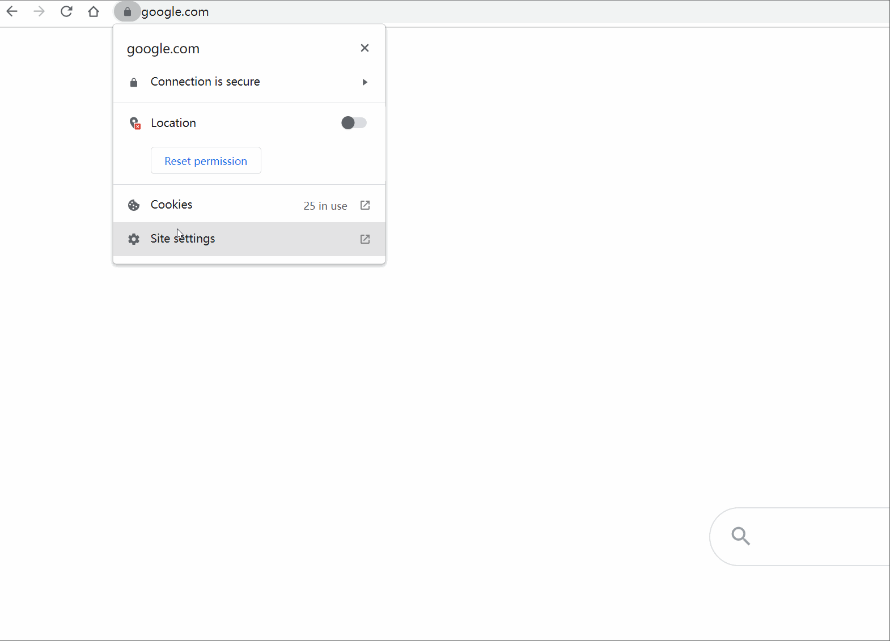
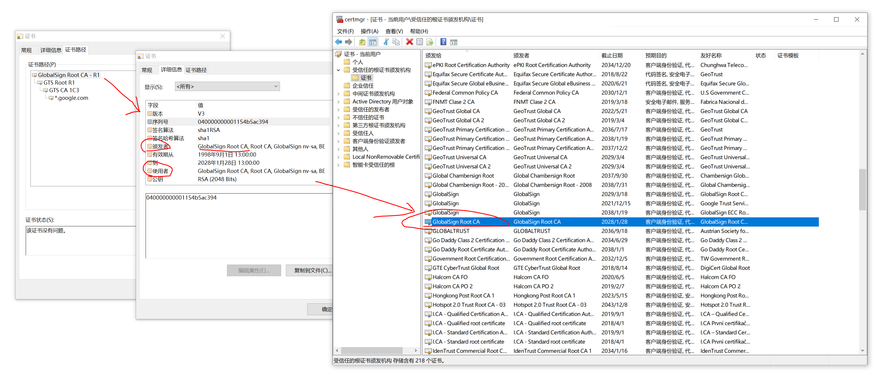

# 证书链 Chain of Certificates

这一节我们聊聊证书链的问题。

## Intermediate CA

常见的证书实际上很多都不是直接由Root CA签发了，而是由中间Intermediate CA签发的，而且有可能会有多个Intermediate CA.

比如下面Google这个，有一个Root CA，两个Intermediate CA

## Chain of Trust

这么多CA，一层层去签名生成证书，那这个信任是如何传递的呢？先上图：

实际上很简单，就是一层层签名，已上面这个图为例。

### CA的根证书

CA的根证书实际上是一个自签名证书，因为它已经是根了，没人再帮它签名。也就是它的使用者（owner）和签发者（issuer）是同一个。

### Intermediate CA

Intermediate CA把自己的公钥连同自己的相关信息，拿去给Root CA签名，从而有了Intermediate Certificate。

### 最终用户

最终用户把自己的公钥连同自己的相关信息，拿去给Intermediate CA签名，从而有了最终用户的证书。
