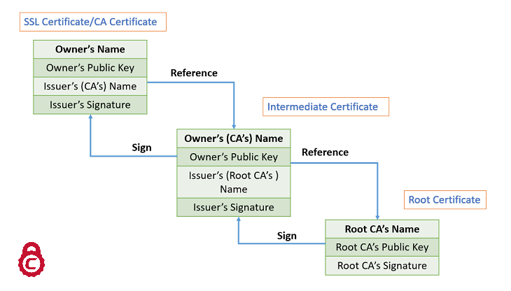

# 证书链 Chain of Certificates

这一节我们聊聊证书链的问题。


## Intermediate CA

常见的证书实际上很多都不是直接由Root CA（根证书颁发机构）签发了，而是由中间Intermediate CA（中间证书颁发机构）签发的，而且有可能会有多个Intermediate CA，有点像这个分店，经销商的感觉。

比如下面Google这个，有一个Root CA，两个Intermediate CA


## Chain of Trust

根证书和中间证书，这么多CA，一层层去签名生成证书，那这个信任是如何传递的呢？

先上图：



实际上很简单，就是一层层签名，信任一层层传递的，以上面这个图为例。


### CA的根证书

CA的根证书实际上是一个自签名证书，因为它已经是根了，没人再帮它签名。也就是它的使用者（owner）和签发者（issuer）是同一个。


### Intermediate CA

Intermediate CA把自己的公钥连同自己的相关信息，拿去给Root CA签名，从而有了Intermediate Certificate。


### 最终用户

最终用户把自己的公钥连同自己的相关信息，拿去给Intermediate CA签名，从而有了最终用户的证书。


## 证书链在实际配置中需要主要的问题

对于这种存在证书链的情况，如果缺失中间的证书，对于HTTPS来讲，就会导致浏览器出现找不到证书的问题，因为并不是所有的中间证书都会安装在操作系统中，这个时候就需要网站在提供自己证书的同时要提供中间证书。

具体的方法就是在你的证书文件里（crt文件）里，把中间证书也加上，类似下面


```bash
demo@web-server:~/self-sign/https$ more my-website.crt
-----BEGIN CERTIFICATE-----
你的证书
-----END CERTIFICATE-----
-----BEGIN CERTIFICATE-----
中间证书证书
-----END CERTIFICATE-----
```