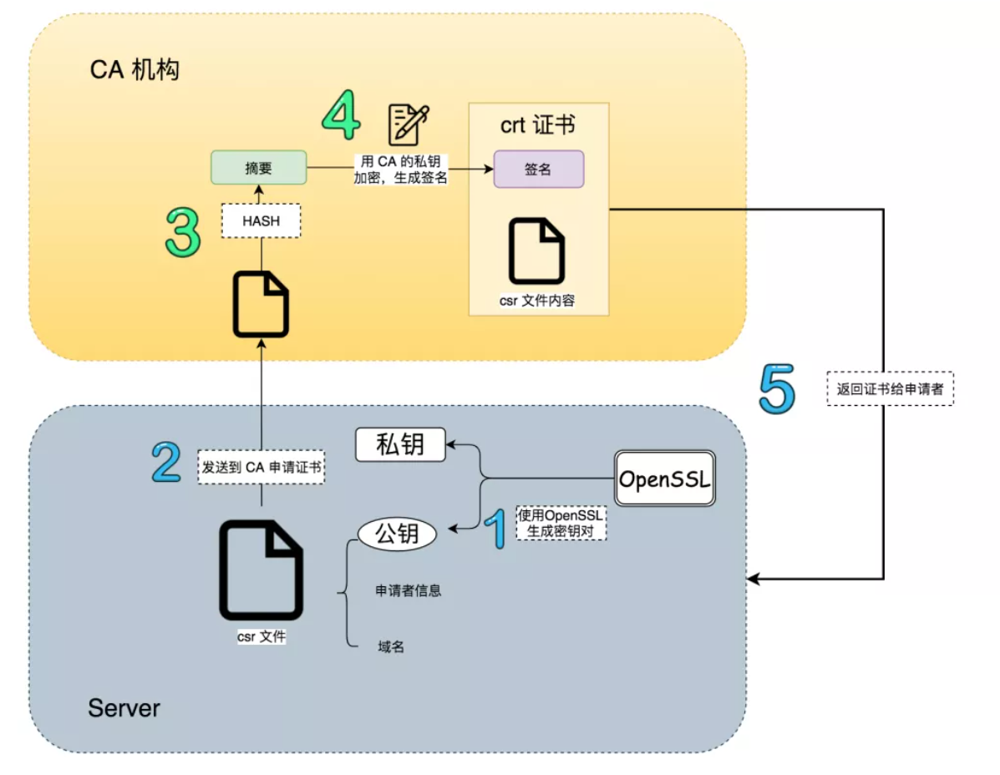

# Digital Certificates 数字证书

前面我们已经聊了数字签名，这一期我们聊数字证书。

在聊数字证书之前，我们先看一个概念 Public Key Infrastructure，或者叫PKI。简单来讲，它是一个在数字世界里用来认证用户或者设备的技术，由一些受信任的机构签发一个特殊的“文件”来证明一个秘钥属于特定的用户和设备，用户和设备从而可以使用该认证过的秘钥来代表自己的身份，进行消息的传递。

这种用来签发证书的机构，我们称之为certificate authority (CA)，经由它签发的“文件”我们称之为certificate证书。

我们签名讲过的数字签名在PKI中扮演非常重要的角色，certificate证书的内容是什么？ CA是怎么签发证书的呢？

## certificate证书其实是一种特殊的签名

我们知道数字签名可以验证身份，但是前提是对方有你的公钥，所以公钥的分发非常关键，如何证明这个公钥就是你的呢？答案是，找一个大家都信任的机构（CA）给你的公钥进行签名，获取到证书，别人收到就信任你的公钥了。

比如在我们的系统中，一般都内置了一些受信任的机构的公钥，只要收到这些机构的签名数据，我们很容易就可以验证数据的真假。

## certificate证书里包含什么内容

一般来讲，证书包含以下内容

- 证书拥有者的基本信息，（比如HTTPS证书的话，包括拥有者的域名CNAME，公司或者组织名称，地点等）
- 证书颁发者的基本信息
- 证书拥有者的公钥
- 对公钥和其他信息的签名

用下面这张图来表示整个过程（可以看到其核心技术，还是我们之前讲过的数字签名，只不过这个签名比较权威而已）

## 自签名证书

自签名证书顾名思义，就是不经过CA，而是自己通过自己的私钥进行签名产生的证书。

