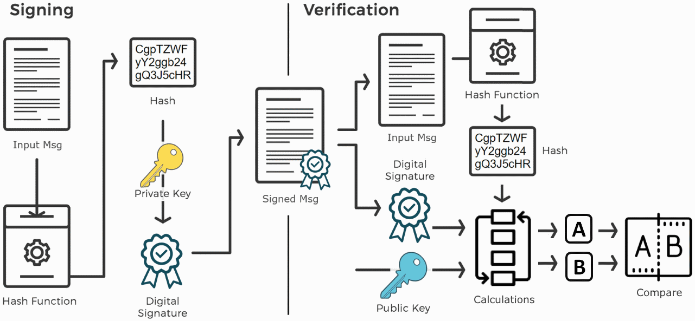

# RSA Sign/Verify with Python

上一节我们聊了数字签名的流程，数字签名的算法有很多种，这一节我们一起演示其中使用比较广泛的RSA签名。

我们会分别用`Python`和`openssl`做演示，这一节先看Python。

上图：



## 生成公钥私钥

首先我们需要通过RSA算法去生成一对公钥私钥。

我们在讲`PKI`的时候，讲过如何生成RSA公钥私钥，当时我们的生成的公钥和私钥分别是：

- 公钥: N = 2290661, e = 65537
- 私钥：N = 2290661, d = 489473

我们这个key只有22位，安全性是很低的。今天我们介绍另外一个可以生成RSA秘钥的Python库 `pycryptodome`, 可以通过pip安装

```python
pip install pycryptodome
```

然后可以通过下面几行代码生成一对RSA key，长度是`1024bit`

```python
from Crypto.PublicKey import RSA

key_pair = RSA.generate(bits=1024)
print("Public key:")
print(f' N={hex(key_pair.n)}')
print(f' e={hex(key_pair.e)}')
print("Private key:")
print(f' N={hex(key_pair.n)}')
print(f' d={hex(key_pair.d)}')

```

每次生成的key是不同的，比如(因为10进制这个N比较大，我们就用16进制表示)

```
Public key:
 N=0xccc50269334a382ce025e1a003a579192ac52f17741529c8ba10bc11c429aae8d23550ed1e632b57b8743754c924b02f5fa7fc38769a498f26aa0c05a513a74eab639e58040798a79808ce11e9df7f2c301c7624d5289df9bdfa0fa13ff7e6dc12d4e720980fd433e87b617be7cbf42999bd652186b806b83e919e6dfc4992ff
 e=0x10001
Private key:
 N=0xccc50269334a382ce025e1a003a579192ac52f17741529c8ba10bc11c429aae8d23550ed1e632b57b8743754c924b02f5fa7fc38769a498f26aa0c05a513a74eab639e58040798a79808ce11e9df7f2c301c7624d5289df9bdfa0fa13ff7e6dc12d4e720980fd433e87b617be7cbf42999bd652186b806b83e919e6dfc4992ff
 d=0x34f22dc4e8cba489c9ed51910fd04de7197d81c7252f41ae129a381eb9e3723b1ffb4431037deddb91288f93ff2c5ad7ecfa610772774354ddd0f329d47ca7f2038882cd81b912a3f0203d1e5d1ddfeda20056069ba2895bde1e052b11c1aefb50a65c0728e2d0c24d2a183b29019fe398f84105df30e5bbc15952a3bd3a55b1
```

## 生成签名

生成签名的过程实际上就是使用私钥对信息进行加密的过程，但与普通加密过程不同的是，签名并不是直接对明文信息进行加密，而是对明文信息的哈希进行加密。

```python
# RSA sign the message
msg = b'A message for signing'
from hashlib import sha512
hash = int.from_bytes(sha512(msg).digest(), byteorder='big')
signature = pow(hash, key_pair.d, key_pair.n)
print("Signature:", hex(signature))
```

这里我们直接使用了Python内置的pow方法进行乘方和模运算。

```python
>>> help(pow)
Help on built-in function pow in module builtins:

pow(base, exp, mod=None)
    Equivalent to base**exp with 2 arguments or base**exp % mod with 3 arguments

    Some types, such as ints, are able to use a more efficient algorithm when
    invoked using the three argument form.
```

最后得到的签名十六进制如下：（另外签名的长度和RSA key的长度是一样的，1024bit）

```
Signature: 0xbbc78498094db0fd62288e2b168746aa7e962b1bdd242ab21b3799a22fd6a86bc64e590f807c7ce3bab01f880edd271a669d26f18279a955903d1bdfee76bb93d0f483c59e8d5b0f747e390e5387b412892ccac9d2f94b55f6879d0810f5fa27f1b7e30845093c146d4519d9af1d45de944abe3518485407794e8d597ebc8a03
```

## 签名的验证

拥有公钥一方，在收到这个签名和明文消息以后，可以进行签名验证，具体过程如下

```python
# RSA verify signature
msg = b'A message for signing'
hash = int.from_bytes(sha512(msg).digest(), byteorder='big')
hash_from_signature = pow(signature, keyPair.e, keyPair.n)
print("Signature valid:", hash == hash_from_signature)
```

通过公钥对签名进行解密，得到一个哈希值，如果这个哈希值和明文信息的哈希值一样，则签名验证通过。
