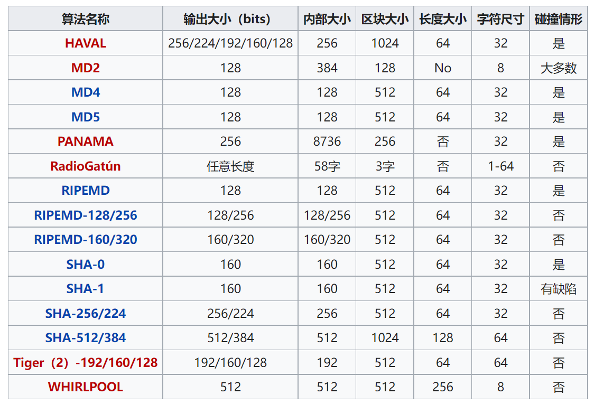
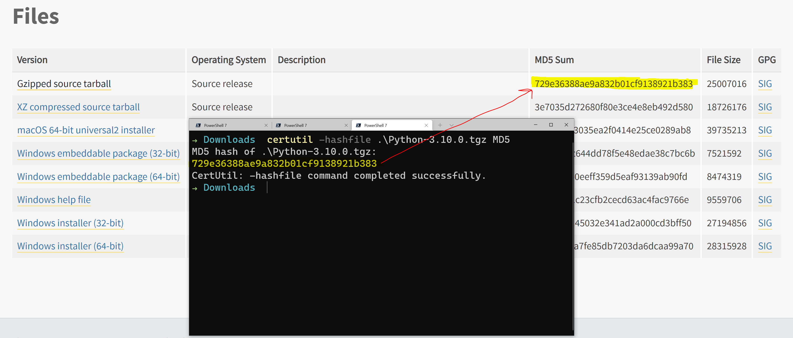
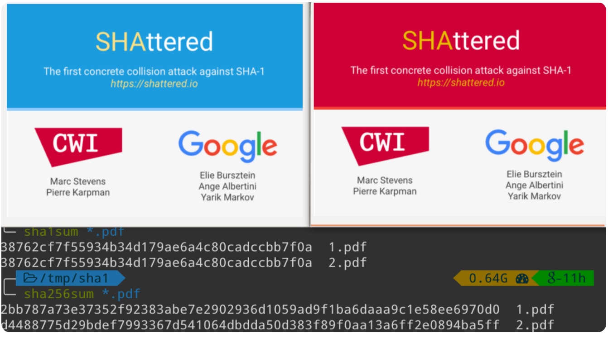

# Hash Function 哈希函数

这一期我们聊哈希函数（又称之为散列函数），这个大家都应该不会陌生，程序员都非常熟悉`哈希表` `Hash Table`这种数据类型。

另外就是几乎在所有`数字加密货币`中，都会用到哈希，一些能够挖矿的加密货币，其实就是通过计算机算力（显卡）去不停的进行哈希计算，感兴趣的同学可以去看看李永乐老师讲的比特币原理视频，链接我放后面。（可以说没有哈希，就没有区块链）

## 那什么是哈希呢？

哈希就是，给定任意长度的输入数据，通过特定的哈希算法，能得到固定长度的输出（哈希值）。


## 哈希算法

根据[维基百科](https://zh.wikipedia.org/wiki/%E6%95%A3%E5%88%97%E5%87%BD%E6%95%B8)2022年1月信息，常见哈希算法如下表所示 （表最后一列的碰撞情形，我们后面单独解释）



目前比较常用的是`MD5`和`SHA`系列（比如比特币用的SHA256算法，Git中的commit hash用的SHA1）.

```python
>>> import hashlib
>>> hash_object = hashlib.sha256(b'Hello World')
>>> hex_dig = hash_object.hexdigest()
>>> print(hex_dig)
a591a6d40bf420404a011733cfb7b190d62c65bf0bcda32b57b277d9ad9f146e
>>>
>>> hash_object = hashlib.sha256(b'Hello World!')
>>> hex_dig = hash_object.hexdigest()
>>> print(hex_dig)
7f83b1657ff1fc53b92dc18148a1d65dfc2d4b1fa3d677284addd200126d9069
>>>
```

可以看到即使我们的输入数据有轻微的变化，得到的哈希值是全然不同的，这是由散列函数的特性决定的。


## 哈希常见使用场景

这里我们先聊两个最常用的，实际还有一些别得，我们后面用到的时候还会详细聊，比如非常重要的`HMAC（Hash-based Message Authentication Code）`。

### 敏感信息存储（shadow file/密码存储）

几乎所有的密码存储都会用到哈希(比如Linux的shadow password文件，比如网站存储用户的密码信息。)，密码的明文存储肯定是不安全的，一旦系统被攻击者攻破，那用户的明文密码直接就暴露了。这些年也经常会爆出来某某网站后台用明文存储了用户的密码的安全事件。

注意一点是的，在存储密码的时候，一般不会直接使用MD5，而是会在MD5的基础上加上salt，主要是为了预防[彩虹攻击(彩虹表)](https://zh.wikipedia.org/wiki/%E5%BD%A9%E8%99%B9%E8%A1%A8),感兴趣的可以去读一些相关的内容(文末有链接)。

```python
>>> import hashlib
>>> password = b"password123"
>>> salt = b"2022"
>>> hash = hashlib.md5 (password + salt).hexdigest()
>>> print (hash)
0cf384aede44a1d1b74c2fa654ceb17e
>>>
```

### 数据完整性校验

比较常见的就是文件下载的checksum，来验证文件的完整性,这里比较常见的是MD5算法。




## 哈希碰撞(散列碰撞)

哈希函数具有不可逆性，也就是无法通过哈希值逆向算出原始输入，这点非常重要，否则通过哈希存储的密码就不安全了，因为可以逆向得到密码明文。

但是哈希的不可逆性并不代表哈希就是绝对安全的，因为有`哈希碰撞`这个问题存在，什么是哈希碰撞呢？

一句话解释就是不同的输入经过同一哈希函数得到相同的输出（哈希值）

也就是假如你的密码是`abc`,存入数据库的哈希值是 `0cf384aede44a1d1b74c2fa654ceb17e`, 黑客通过哈希碰撞，找到了另外一个密码 `xyz`,它的哈希值也是`0cf384aede44a1d1b74c2fa654ceb17e`,这样就不安全了。

在前面那一张哈希算法表最后一列显示，很多算法存在碰撞。比如MD5，SHA-0。 比较著名的是2017年由荷兰一个研究机构和Google联合做出来的一个对SHA-1的哈希碰撞，比如两个完全不同的PDF文件，但是它们有着相同的SHA-1哈希值（具体链接请查看文末的参考链接）。



## 参考链接

- 散列函數-维基百科 [https://zh.wikipedia.org/wiki/%E6%95%A3%E5%88%97%E5%87%BD%E6%95%B8](https://zh.wikipedia.org/wiki/%E6%95%A3%E5%88%97%E5%87%BD%E6%95%B8)
- 比特币和区块链啥原理？矿机挖矿咋回事？李永乐老师讲比特币(1) [https://www.bilibili.com/video/av45247943](https://www.bilibili.com/video/av45247943)
- MD5和salt [https://infosecscout.com/md5-salt-hash/](https://infosecscout.com/md5-salt-hash/)
- 彩虹表 [https://zh.wikipedia.org/wiki/%E5%BD%A9%E8%99%B9%E8%A1%A8](https://zh.wikipedia.org/wiki/%E5%BD%A9%E8%99%B9%E8%A1%A8)
- Linux shadow password [https://www.cyberciti.biz/faq/understanding-etcshadow-file/](https://www.cyberciti.biz/faq/understanding-etcshadow-file/)
- SHA-1 哈希碰撞 [https://phys.org/news/2017-02-cwi-google-collision-industry-standard.html](https://phys.org/news/2017-02-cwi-google-collision-industry-standard.html)