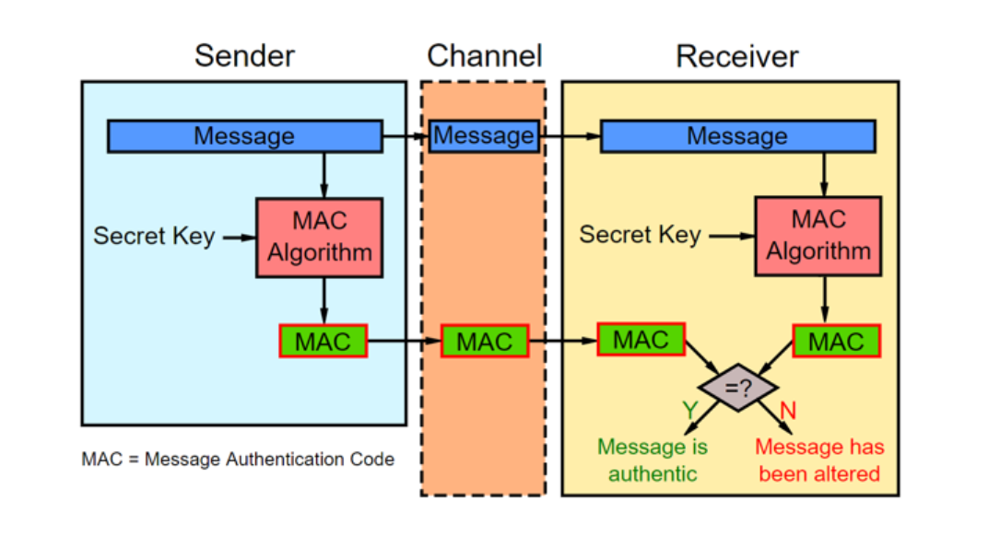

# Message Authentication Codes

前面我们聊了数字签名，这一节来看看`Message authentication codes`，也叫`MAC`，中文`消息认证`。

MAC是用来做什么的？和数字签名有什么不同？

一句话，所谓消息认证，就是为了**防止消息篡改**，数字签名也可以防止消息篡改，两者的不同在于：

- 消息认证一般是用在`对称加密系统`，通信双方共享一个秘钥
- 数字签名是用在`非对称加密系统`，也就是公钥私钥加密

MAC和哈希很像：

- 哈希是对给定的一个数据进行哈希计算，得到一个哈希值

```
digest = HASH(msg)
```

- MAC是对给定的一个数据加上通信双方共享的秘钥，这两个参数，通过MAC算法得到的一个authentication code，认证码。

```
auth_code = MAC(key, msg)
```

## MAC算法

最常见的MAC算法都是基于哈希的，我们称之为`HMAC` (Hash-based MAC, 比如`HMAC-SHA256`)。

使用Python计算HMAC-SHA256：

```python
>>> import hashlib, hmac, binascii
>>>
>>> mac = hmac.new(b'key', b'some msg', hashlib.sha256).digest()
>>> print(binascii.hexlify(mac))
b'32885b49c8a1009e6d66662f8462e7dd5df769a7b725d1d546574e6d5d6e76ad'
>>>
```

## MAC的使用场景



- 通信双方共享一个秘钥，并且协商好MAC的算法（比如HMAC-SHA256）
- 消息发送方把未加密的消息，连同消息+秘钥计算出的MAC值发送给消息接收方
- 接收方通过秘钥和消息计算出MAC值，如果计算的MAC和接收到的MAC值相同，则可以说明消息违背第三方篡改。


## 安全性

HMAC算法的安全性和其哈希算法的安全性相关，比如SHA1和MD5都是不安全的哈希算法，存在哈希碰撞，所以用于HMAC也是不安全的。