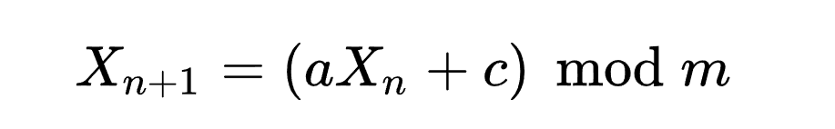

# Pseudorandomness 伪随机

上一期我们聊了One-Time Pad，并且做了一个Python实现，但是实际上我们的实现并不算一个严格的One-Time Pad，因为One-Time Pad这种加密方法有以下几个条件：

- 它的key只能用一次，且key的长度不小于明文的长度
- 只有发送者和接收者知道这个key
- key是`真正随机`生成的

如果要把One-Time pad用于实际工程，最难得就是key得生成和分发，而key的生成需要真正的随机，而我们在Python里的random实际上并不是真正的随机，所以这里就涉及到一个伪随机的问题。

```python
return bytes([random.randrange(0, 256) for i in range(n)])
```

## Pseudorandomness

因为后面的话题会使用到伪随机数，所以就先把这个概念简单说一下，以下解释来自维基百科：

`伪随机性`（Pseudorandomness）是一个过程似乎是随机的，但实际上并不是。例如伪随机数是使用一个`确定性的算法`计算出来的似乎是随机的数序，因此伪随机数实际上并不随机。在计算伪随机数时假如使用的开始值（一般称之为seed种子）不变的话，那么伪随机数的数序也不变。伪随机数的随机性可以用它的统计特性来衡量，其主要特征是每个数出现的可能性和它出现时与数序中其它数的关系。伪随机数的优点是它的计算比较简单，而且只使用少数数值很难推算出计算它的算法。一般人们使用一个假的随机数，比如电脑上的时间作为计算伪随机数的开始值。

## 随机数生成算法

我们在编程语言里使用的随机数生成算法基本都是伪随机，随机数生成的算法很多，其中最简单的一个叫`线性同余方法`, Linear congruential generator (LCG), 它的计算递推公式如下：



其中 `a`, `c`, `m` 是生成器初始设定的常数。`X`初始化的值为seed种子。

(大家如果想了解这个线性同余方法背后的理论，可以寻找相关的数学资料查询)

不同的算法实现对于acm常数的取值是不同的，比如ANSI C，使用的是

```python
m = 2 ** 31
a = 1103515245
c = 12345
```

假如我们初始化seed=1，然后使用生成的随机数继续作为下一轮种子，以此类推生成10个随机数如下：

```python
def lcg(m, a, c, seed):
    """Linear congruential generator."""
    return (a * seed + c) % m


# https://en.wikipedia.org/wiki/Linear_congruential_generator
m = 2 ** 31
a = 1103515245
c = 12345
seed = 1

for _ in range(10):
    rand_n = lcg(m, a, c, seed)
    print(rand_n)
    seed = rand_n
```

10个随机数为：(如果大家使用seed=0，生成的随机数应该是一样的)

```python
1103527590
377401575
662824084
1147902781
2035015474
368800899
1508029952
486256185
1062517886
267834847
```


通过这样的伪随机数生成算法，基本可以解决 One-Time Pad无法实际中使用的问题，key生成解决了，分发也容易解决，因为只要保证收发使用相同的seed，那么每次得到的伪随机数就是一样的，用其进行明文加密解密即可。

但是这样做了以后就不叫One-Time Pad了，这个我们留到下一期再继续介绍。


## 参考资料

https://en.wikipedia.org/wiki/Linear_congruential_generator

https://zh.wikipedia.org/wiki/%E7%B7%9A%E6%80%A7%E5%90%8C%E9%A4%98%E6%96%B9%E6%B3%95